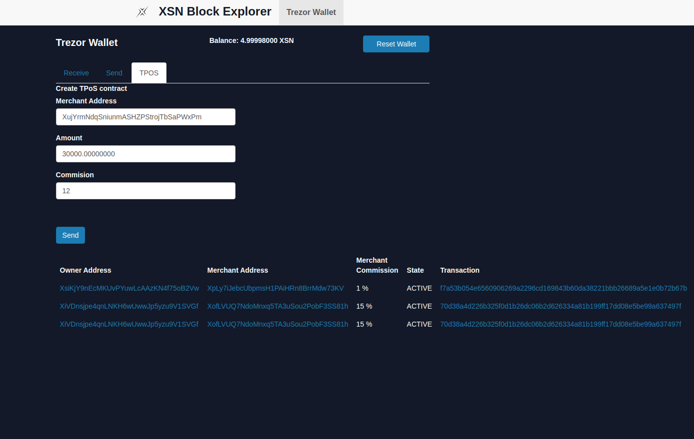
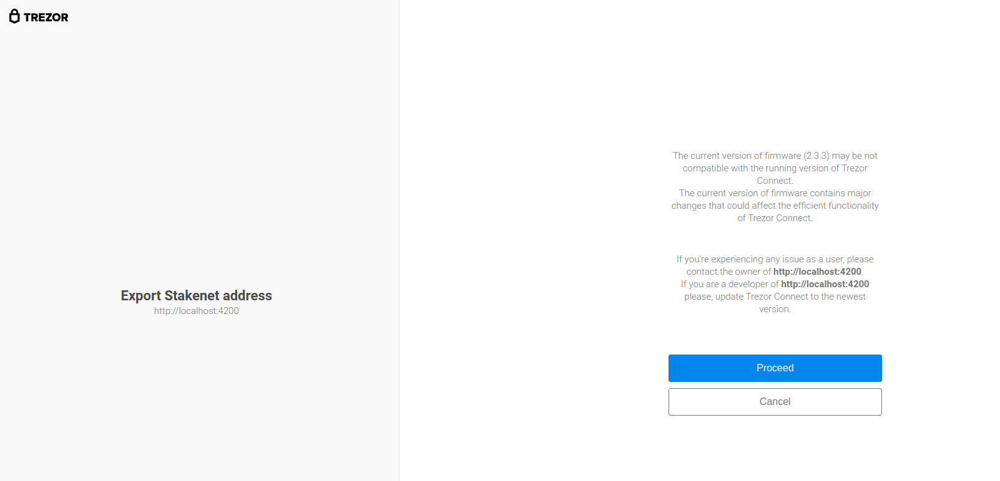
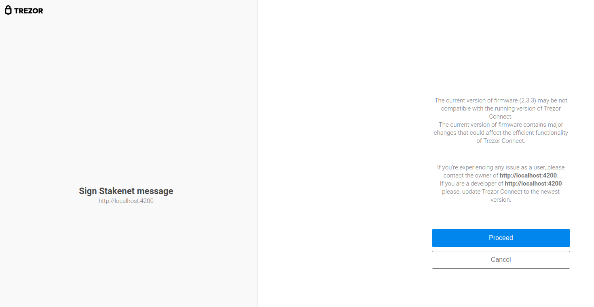
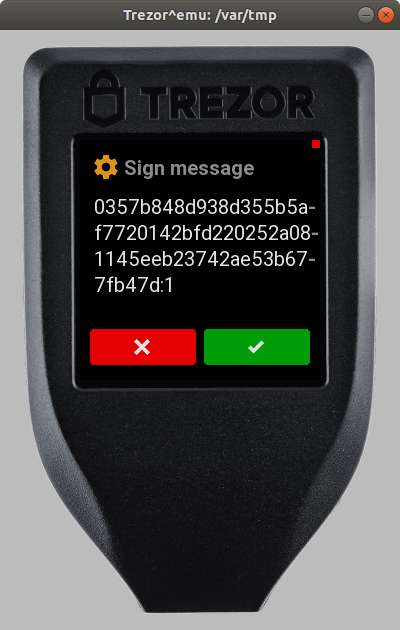
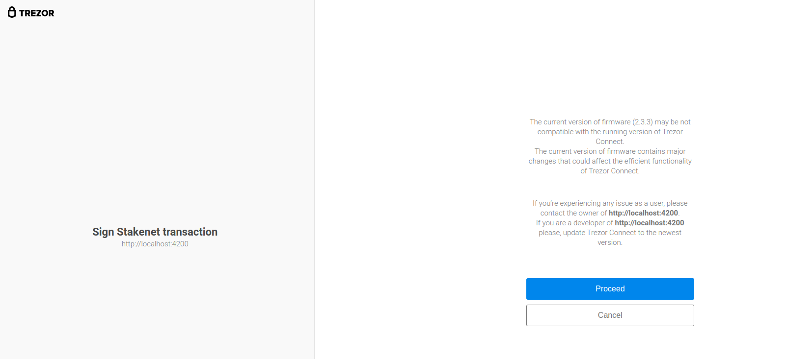
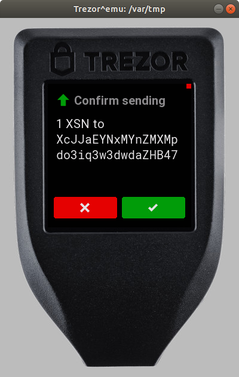
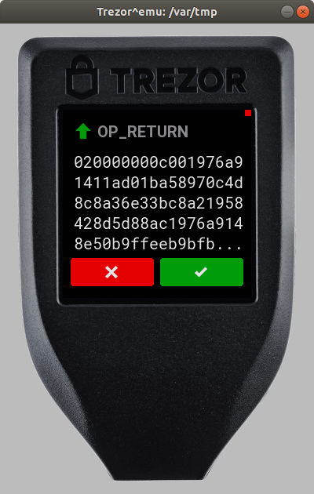
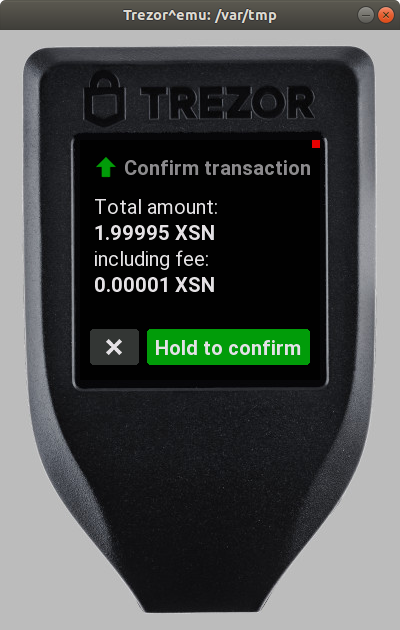
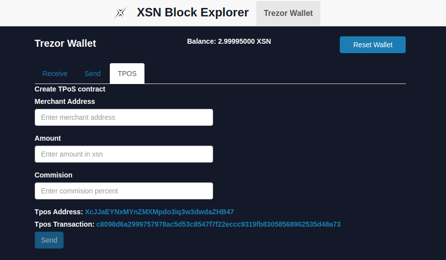

A simple guide for creating TPOS contracts with the trezor wallet using the [block explorer](xsnexplorer.io)  app.

- First you need to connect the trezor wallet to the computer with the trezor bridge running.  
- Download and install the trezord bridge from [Trezor page](https://wallet.trezor.io/#/bridge) 
- You also need to consider that not all browser are supported, to see the list of supported browsers click [here](https://wiki.trezor.io/Supported_browsers)
- If you want to use the [trezor emulator](https://docs.trezor.io/trezor-firmware/core/emulator/index.html) you have to stop the trezord service with `sudo systemctl stop trezord` and then run it with `trezord -e 21324`
- To verify that trezor is connected to the browser, you can visit the link http://127.0.0.1:21325/status/ and see if the trezor device is working correctly.

- Then you have to go to the [block explorer](https://xsnexplorer.io/trezor) page (trezor tab). 

- If you don't have any coins on the trezor wallet, you have to receive some on one of your trezor address.

- The next step is to click on the TPOS tab and fill the form with the values requested:

    * Merchant address: The address of the merchant where reguards will be sent.
    * Amount: The amount to be staked in xsn, this will be sent to the tpos address.
    * Commision percent: The percent commision for the merchant.

- Then click on send.(ensure that trezor is connected and unlocked before clicking on send)

- Each time you create a TPOS contract the app will create a new legacy address, this will be your tpos address which you could add the required amount to stake, and that's why the next step is to allow trezor to create a new address in a screen like this. 

- The next step is to sing a message, this is required to create the tpos contract. you will see a screen like this. 

- - if everything is correct, the app will  request to sign the tpos transaction. This transaction will consist in sending  a collateral (1 XSN) to the recently created legacy address. Also you must approve to receive the change of your utxos in one of your other addresses and the transaction will be sent to the blockchain.

- The last step is to fund your tpos address, the app will try to generate the second transaction with the captured amount in the form, if you only have one utxo, this will fail, because it was used to create the tpos transaction and you can use the change until the tpos transaction is confirmed. so if the second transaction fails, you must wait until the tpos transaction is confirmed and then you could send the funds to the tpos address manually.

